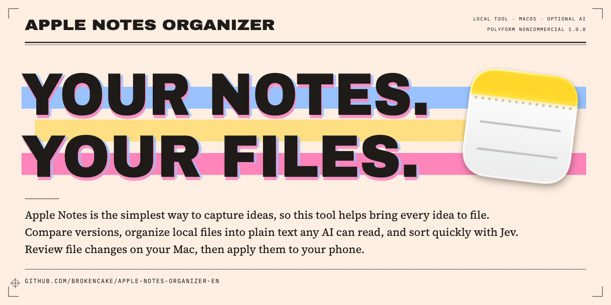
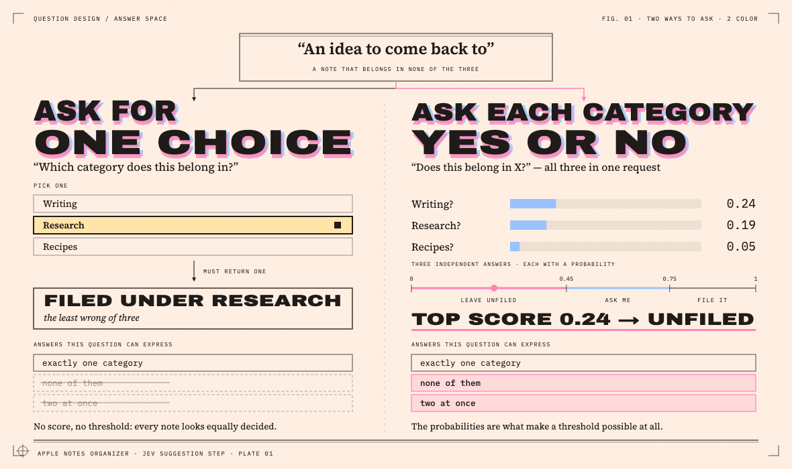
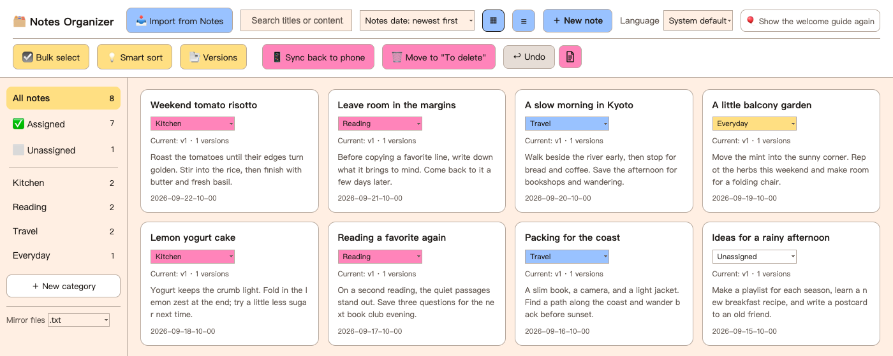
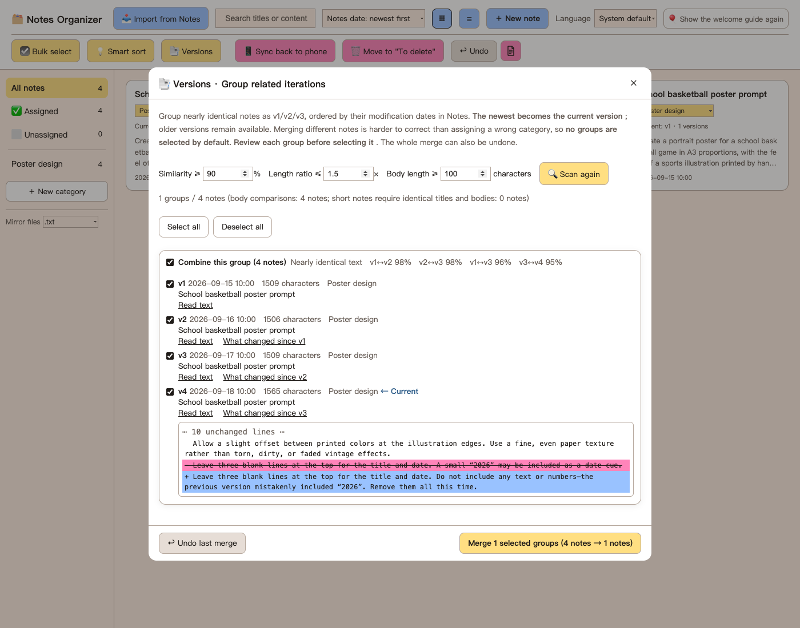
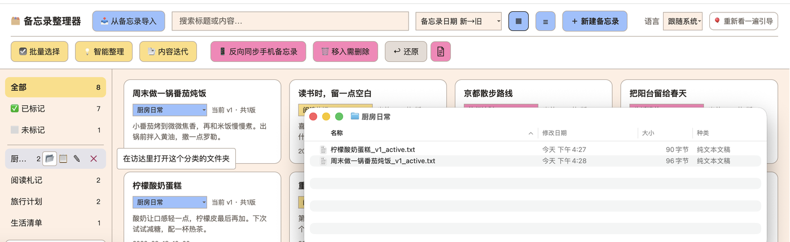

# Apple Notes Organizer

English | [中文](README.zh-CN.md)



## Why this tool exists

**Notes makes starting easy. This tool helps every idea find a place.**

Write a note from the lock screen without unlocking, say a sentence to Siri, or save something through Share in two taps. Because getting things in is so easy, everything ends up there — last week's recipe, something to buy, an article saved for later, a sentence that arrived in the middle of the night.

Getting things back out is harder. Much of it goes in and never comes back, piling up into a mountain.

This tool is the exit that was missing. **Pull notes out in bulk, organize them into local plain text on the Mac (`.txt` by default, with `.md` also available), then file the original notes back into Notes where they belong.**

No cable, no unlocking the phone, and nothing to install on it. This tool works with Notes on the Mac; iCloud syncs the changes to the phone.[^1]

No migration. Notes stays the place where writing starts instantly; organizing moves to a bigger screen, and Notes on the phone becomes tidier too.

> The interface follows the Mac's preferred language: Chinese for Chinese system languages, English otherwise. The Language menu at the top switches manually.[^2]

## Why not switch to another notes app

Because **capturing and organizing are not the same contest**.

For organizing — structure, search, plugins — apps such as Obsidian already exist.

Capturing is about something else: how many steps stand between wanting to write and seeing the words on screen. The built-in Notes app makes that easy.
This is not the Nth notes app. It is the only one that works on what is already there, then tidies up the original place too.

### How this differs from Apple Intelligence

This tool is built around what happens *after* a large pile of notes has accumulated: turning it into material that can be found and used. It sorts in bulk on the Mac, compares and merges different versions of the same content, saves local text files grouped by category, and then files the original notes back into place after an itemized move list has been reviewed. Every move is logged, and batches can be restored.

## What it does

**When Notes has become a tangled mess, this tool sorts it out.**



- Optional AI assistant: Jev reads note content and quickly suggests categories. Accepting a suggestion is a manual step. Importing, organizing, exporting, and filing notes all work on their own.[^3]
- Local text files: the material stays on the local drive: notes are stored as local JSON and plain text (`.txt` or `.md`), without uploading them.
- Sensitive information protection: **notes holding passwords are stopped on the Mac**: API keys, ID numbers, and password-shaped text are checked locally and excluded from AI requests by default. In **Smart sort → Privacy controls**, the built-in rules can be turned off together, add custom terms, and edit the never-send folder list; that list applies regardless of the Send sensitive content switch.
- **Lightweight**: Python 3's standard library and macOS `osascript`, with no npm, pip packages, or CDN.
- **File the results back into Notes**: apply the categories chosen on the Mac by moving source notes into matching Notes folders. Review an itemized list of each source and destination before confirming. After moving, **Undo** returns that batch to its original folders; every move leaves a log, opened with **Move log**. Entries deleted from the organizer can be moved into a staging folder for review in Notes. An edited note can also be sent back from the Mac.[^4]

---

### Who it is for

Made for people who keep notes in Apple Notes as they go, and later need to turn what has piled up into finished work, proposals and working material.

| Who | What gets jotted down on the phone | What this tool does with it |
| --- | --- | --- |
| **AI users who edit prompts constantly** | Prompts, instructions revised over and over, different prompts per task | Sort by purpose, keep and compare several versions, mark the current one, copy it out whenever needed — instead of one prompt slowly degrading |
| **Novelists, screenwriters, writers** | Plot, dialogue, character notes, alternate versions of a passage | Group scattered pieces by work or theme, compare revisions, keep old drafts |
| **Editors, reporters, content creators** | Story ideas, interview notes, quotes, article drafts | File material by story, and gather repeated revisions of the same piece in one place |
| **Marketing, copywriting, brand teams** | Taglines, campaign ideas, client feedback, competitor copy | Organize by brand or campaign, and build up copy and material worth reusing |
| **Researchers, students, knowledge workers** | Reading excerpts, observations, open questions, research ideas | Organize by topic and export the text to carry on writing a report or paper |
| **Product managers, founders, solo developers** | User feedback, requirements, product ideas, technical notes, debugging findings | Move fragments into the specific project they belong to, and keep the trail of how a plan changed |
| **Consultants and freelancers** | Client conversation points, project thinking, draft deliverables | Organize by client and project, so material and versions stop running together |

## Screenshot







The screenshot uses sample notes, not personal data.

## Language support

- **System default:** reads the Mac’s first preferred language. Chinese system languages use the Chinese interface; other languages use English. If macOS preferences cannot be read, the server checks environment locale settings, then falls back to English. If the locale API is unavailable, the browser’s language is used.
- **Manual choice:** use **Language → English / 中文 / System default**. The choice is saved in this browser. Switching languages does not create a separate library. Unsaved edits require confirmation before switching.
- **Content:** UTF-8 note titles, text, and category names may mix languages, accents, emoji, or right-to-left text. The organizer does not translate note text. Title and category sorting use the browser’s locale instead of a hard-coded Chinese order.
- **Notes integration:** uses the app’s bundle identifier and asks Notes for the default account folder rather than guessing its translated name. If the default folder cannot be identified, the organizer skips moves that would require it and explains why.
- **Platform:** macOS is still required for Apple Notes integration; this does not add Windows, Android, or iOS execution support.

## Installation and startup

A Mac with Python 3 available is required. No third-party Python packages are required. If Python 3 is missing, install it first[^python-install] below. The source is readable before downloading[^source-readable], and the download can be checked against a checksum list[^checksums].


### 1. Download

At the top of the repository page, choose the green **Code** button → **Download ZIP**. When the download finishes, double-click the zip to extract it.

**The extracted folder is the program. Use it where it is; there is no need to move it.**[^icloud-location]

The program and the data you organize later both stay in this folder.[^checksums]

### 2. Open it for the first time

Double-click **`note-organizer.app`** inside the folder.

**macOS will block it once.** The dialog has two buttons; one is **Move to Trash**.

**Do not choose Move to Trash. Choose the other button.**

This does not mean something is wrong with the program: it does not carry a paid Apple developer signature, and macOS shows this message for every unsigned program. Then:

1. Open **System Settings → Privacy & Security** and scroll down to **Security**.
2. Find the message saying the program was blocked and choose **Open Anyway** beside it.
3. In the next confirmation dialog, choose **Open**.
4. This step requires **the login password for this Mac**.

> ⚠️ **Open Anyway appears only for a short time after the app is blocked.** If it is missing in Privacy & Security, double-click the app again, then return there immediately.

If the app will not open, double-click **`note-organizer.command`** in the same folder. It is also a launch button.

A Terminal window opens, and the browser automatically opens `http://localhost:8788`. **Continue in the browser, and keep the Terminal window open.**

### 3. Allow access to Notes

The first time **Import from Notes** runs, macOS may ask whether Terminal can control Notes. Choose **OK** so the tool can read the notes.

If access was denied earlier, go to **System Settings → Privacy & Security → Automation**, find Terminal, and enable Notes under it. Reading and writing use the same permission.

### Create a desktop shortcut

In Finder, Control-click `note-organizer.app` (or `note-organizer.command`), choose **Make Alias**, and move the alias to the desktop. The alias can be renamed or given a different icon. The actual application and data folder should remain outside synced locations.

### Command-line setup

<details>
<summary><strong>Command-line setup</strong></summary>

```bash
git clone https://github.com/BrokenCake/apple-notes-organizer-en.git
cd apple-notes-organizer-en
chmod +x note-organizer.command
./note-organizer.command
```

</details>

## Using the organizer

### First-time setup

An empty library offers a short, optional setup: choose suggested categories with ready-to-edit descriptions, add more, optionally create an Accounts & passwords category on the never-send list, and optionally enter an API key. Editing a suggested name or description selects that row automatically. Every step can be skipped; importing, editing, exporting, and filing notes work without a key. Existing libraries do not show this guide.

### Import from Notes

Choose **Import from Notes**, select notes, choose a destination category, and import the selection.

Already organized in Notes? Check **Use the folders from Notes** to import everything in one pass, with each folder becoming its own category. The single-destination controls are disabled while this is checked; notes in default or staging folders remain unassigned.

- The panel shows the number of matching notes and the total number in Notes.
- The list renders in batches while scrolling. **Select all matching** selects the entire filtered result, including rows that have not been rendered yet.
- The selection survives scrolling, searching, and switching folder filters.
- Previously imported notes are marked **Imported** and hidden by default to avoid duplicates.
- **Importing copies the text. It does not change the original notes.**

### Everyday editing

- Categories appear in the sidebar. Open a card to edit it.
- **Assigned / Unassigned** show entries that have or have not been assigned to categories. When sorting a large import, use these filters to work through the unassigned entries.
- **Save changes** updates the current version. **Save as new version** keeps the old version and makes the new one active.
- Choose a version chip, such as v1, v2, or v3, to inspect an earlier version. **Make current** restores that version as the active one.
- **Copy text** puts the entire text on the clipboard.
- The editor shows the character count (excluding whitespace) and line count; selecting text shows the count for that selection.
- Search includes the body text and older versions.
- Press **⌘S** to save.

### Views and sorting

Use `▦` and `☰` to switch between grid and list views. List view is useful for large libraries. The view preference is remembered.

Sort options include:

- Notes modification date, newest first (the default).
- Notes modification date, oldest first.
- Organizer update time.
- Category.
- Title, A–Z.

A bulk import gives many entries almost the same organizer update time. Sorting by the original note's modification date is usually more useful.

### Bulk organization

Choose **Bulk select** to show selection checkboxes.

- Clicking a card selects or deselects it instead of opening the editor.
- **Select all matching** includes all filtered entries, not just visible cards.
- **Move** assigns selected entries to another category. Choose a destination first; the button is disabled while **Choose a category…** is selected. After a move, the destination resets so the next move requires a new selection.
- **Delete selected** shows the number of entries and versions before asking for confirmation.

### Versions

Choose **Versions** to find notes that may be versions of the same thing. **No group is selected by default.** Open a group to see what changed from one version to the next: additions and deletions are highlighted, and unchanged passages are folded away, so two windows side by side are unnecessary. Individual notes can be left out of a group before selecting it.

The scan has three adjustable settings: overlap (90% by default), maximum length ratio (1.5), and minimum body length (100 characters). Review the groups before merging: similarity alone does not mean two notes belong together.

Merging keeps the newest note as the active entry, including its title, category, and link to its source in Notes. The other notes become earlier versions. It changes only the organizer; the original Apple Notes are untouched. **Undo last merge** restores the original entries from the most recent merge. Both actions ask for confirmation.

### Send edits back to Notes

In the editor, choose **Add notes to phone**. The version currently on screen is the one sent.

| Mode | Behavior |
|---|---|
| Create a new note | Default. Creates a note in the chosen folder. The default destination is the note’s category folder, or `Notes Organizer` for an unassigned note; it is created if needed. The original note is unchanged. |
| Update the last exported note | Available after the first export. Repeated exports update the same note. |
| Overwrite the source note | Replaces the original imported note with the current version, after confirmation. |

**The tool can create and update notes, but it never deletes notes from Apple Notes.**

### Organize the source notes into folders

Choose **Sync back to phone** to move the source notes into Notes folders matching the organizer's categories. Jev is step 0 of that dialog and is optional; steps 1 and 2 work with no API key and no network access.

The dialog has two steps. Each shows an itemized preview with the title and the source and destination folders before it runs. These operations move notes between folders; they do not create or delete notes or edit their text.

If an old category folder has disappeared and at least 80% of two or more linked notes now share another folder, a card flags a possible folder rename before the move list. Confirming updates the organizer’s category name to match; note text and Notes folder locations stay unchanged.

**Sync back to phone**

- Notes assigned to a category move into a matching folder, which is created if necessary.
- Notes that are now unassigned but remain in a category folder return to the default Notes folder.
- Notes that have never been imported into the organizer are left alone.

Handling both directions prevents notes from being left in old category folders after their categorization changes.

**Move to “To delete”**

This handles entries deleted from the organizer but still present in Notes. After showing a count and asking for confirmation, it moves them into the `To delete` folder, creating it if necessary. Existing `需删除` staging folders remain recognized for compatibility.

**It only moves notes. It does not delete them.** Review that folder in Notes yourself before deciding what to remove.

Before moving a note, the tool records its original folder in `Notes Library/restore-map.json`. Choose **Undo** to restore the most recent batch of recorded locations. Moves involving several categories are undone one batch at a time. Each run also saves a Markdown movement log under `Notes Library/Move Logs/`, listing each note and its source and destination. Batches belonging to the same operation share a log. Choose **Move log** to open it.

### Suggest categories with Jev (optional)

Sorting a large import is the slow part: a few hundred notes, one glance each, deciding which category every one belongs in. **💡 Smart sort** can ask [TypeSafe's Jev](https://typesafe.ai) to go first. It is optional, off until an API key is added, and it never moves anything.

**Why one yes/no question per category, rather than "pick the best one"**

A forced single choice has to put every note somewhere. A note that belongs in none of the categories still comes back assigned to whichever one is least wrong, with nothing in the result to distinguish it that case apart from a confident answer.

So each note is asked one question per category — *does this belong in "Research"?* — with every category's question travelling in a single request. That shape allows two answers a forced choice cannot express:

- **none of them** — the note is genuinely unfiled, and saying so is the correct answer;
- **several of them** — the note sits between two categories, which is exactly the case a person should look at.


Every answer carries a probability, and that is the only reason a meaningful line can be drawn between what gets filed and what gets asked about. Three thresholds draw it, all adjustable in **Smart sort → Suggestion thresholds**:

| Setting | Default | Meaning |
| --- | --- | --- |
| Top score ≥ | 0.75 | High enough to file automatically |
| Top score < | 0.45 | Too low for any category — leave the note unfiled |
| Must beat the runner-up by ≥ | 0.15 | Below this the top two are too close to call |

Each note then lands in one of: **Will file**, **Ask me**, **Unfiled**, **Skipped**, or **Error**.


The expanded row above is the case the whole design exists for: 0.72 against 0.64 is not a close second, it is two categories the note could honestly go in. A forced single choice would have filed it silently.

**Nothing is filed without confirmation.** The run only produces a list. **✓ Apply ready suggestions** sets the category field on the rows marked *Will file* — that is a local change to the organizer, not to Apple Notes. Moving the actual notes still uses **📱 Sync back to phone**, with its own preview and undo. Every row has a dropdown, so any suggestion can be overridden before accepting it.

**What is sent, and what is not**

- Only the notes in that run, and only the **first 4000 characters** of each body plus its title.
- **Whether a note looks like it holds credentials is decided on the Mac, before anything leaves the machine.** API keys, tokens, national ID numbers, US Social Security numbers and password-shaped lines are matched locally, and a note that matches is stopped right there — not sent, not read by anyone else, returned marked *Skipped*. The rule is deliberately broad, down to any unbroken 32-character alphanumeric run, because a missed suggestion costs nothing and a leaked key costs a great deal.
  - **It is on out of the box.** Change the scope in **Smart sort → Privacy controls**: turn the built-in rules off together, add custom terms (one per line, matched anywhere without case sensitivity), or enable **Send sensitive content**. Turning off the built-in rules leaves custom terms and folder exclusions in effect.
  - Edit **Skip these folders entirely** in the same section. These Notes folders are skipped without fetching their bodies for classification, and **stay excluded whether Send sensitive content is checked or not**. They are saved as `neverSend` in `Notes Library/jev-config.json`.
- A **keyword layer runs first and locally**. If a note's title or opening matches a keyword set for exactly one category, that decides it — no request, no cost. Matching several categories deliberately decides nothing.
- The API key is stored in `Notes Library/jev-config.json` with permissions `600`, excluded from Git, and never returned to the browser. The `TYPESAFE_API_KEY` environment variable instead.
- Everything else — the library, the text mirror, every note outside the run — stays on the Mac.

**Getting good suggestions**

Write one sentence per category in **Smart sort → Describe your categories** describing what it holds. This matters far more than the thresholds: given only the name "Fragments", the model has nothing to work with; given "quotes, examples, and source links saved for articles I am writing", it does. Categories with no description are flagged before a run.


Expand any row to see the body text the call was made on, the score for every category, and the description that produced it. Two numbers are reported because they decide whether the scores mean anything at all: **an empty body** means only the title was seen, and **incomplete scores** mean the response did not line up with the request. Neither is a bad judgement, and tuning thresholds before both are zero is wasted effort.

### Open a category's files

Hover over a category in the sidebar and choose **📂** to open its text folder in Finder, or **📋** to copy the folder path. The folder is `Notes Library/Text Mirror/<category>/`; each note version has its own file, with `_active` marking the active version. The files can be read directly, or the path shared with a tool that can read local files.

Choose **Mirror files → .txt / .md (Markdown)** below the sidebar's new-category button. The default is `.txt`; `.md` lets Markdown editors display formatting already in the notes. Switching changes the filenames, preserves the content, and removes the old mirror files on save. There is no format conversion.

## Application files and compatibility

- `note-organizer.app` contains the icon and opens `note-organizer.command` in Terminal; `server.py` serves `app.html`. The app searches beside itself first, then the last folder chosen, then asks for one. Its saved choice lives in `~/Library/Application Support/NoteOrganizer/folder`.
- Open `note-organizer.app` or `note-organizer.command` to start `server.py`. The `app.html` entry page selects `app.en.html` or `app.zh-CN.html` using the same language preference.
- Everything this edition writes to disk is named in English, so the folder shown in Finder reads the same way as the interface. A library from an earlier edition is renamed in place on first start — `备忘录整理/` becomes `Notes Library/`, and its contents follow. Renaming only: nothing is copied, merged or rewritten, and note text is untouched. If both names somehow exist, neither is touched and the Terminal window says which one is being read. Schema fields inside the JSON and existing Notes folder names are left exactly as they are.
- New exports default to the note’s category folder, or `Notes Organizer` for an unassigned note. A different destination can be chosen for each export. New deletion-staging operations use `To delete`, while recognizing the legacy `需删除` folder.

## Where the data lives

Everything lives in one folder beside the application, so moving the folder moves the data with it:

```text
Notes Library/
├── library.json                  Main library
├── library.backup.json           Backup from before the last save
├── jev-config.json               Jev settings and API key (mode 600, git-ignored)
├── restore-map.json              Original note folders, recorded before a move
├── merge-log.json                Original entries for undoing the last merge
├── Snapshots/                    Up to 10 snapshots before large deletions
├── Move Logs/                    A Markdown log per organize operation
└── Text Mirror/                  Text files for every version, grouped by category
    └── <category>/<title>_v<N>[_active].txt
```

Unfiled entries are mirrored under `Text Mirror/Unfiled/`. With `.md` selected, mirror files use that extension instead.

**Treat `Text Mirror/` as a read-only mirror.** These files can be read or copied, but direct edits will be overwritten by later saves. Edit content in the browser interface.

To recover an accidental deletion, stop the application, choose the appropriate snapshot from `Snapshots/`, copy it to `library.json`, and restart. Preserve a copy of the current library before replacing it.

Keep the application and data folder outside iCloud-synced Desktop and Documents locations. Every save rewrites the library file; frequent synchronization can create conflicts or restore deleted files. A non-synced folder in the home directory is suitable.

### Why there are snapshots as well as a backup

`library.backup.json` contains only the state before the most recent save. Two consecutive saves can overwrite the very backup that was needed. During development, deleting all entries and then reimporting left the backup containing the empty state in between.

The snapshot mechanism addresses this: when a save reduces the entry count by **10 or more**, it first stores the existing library in `Snapshots/` as `library_<timestamp>_<count>-entries.json`. It retains the latest 10 snapshots. Keep this folder to retain that recovery option.

## Known limitations

- Saves replace the whole library. Editing in multiple browser tabs can cause one tab's save to overwrite another's changes. Use one editing tab at a time.
- Importing thousands of notes can take several minutes. Bodies are fetched through `osascript` in batches of 25. Progress appears beside the import button, and already imported entries are saved if an error interrupts the process.
- The Notes date is the **modification date**, not the creation date.
- Sending edits to Apple Notes is a single-entry operation, with no bulk send.
- Notes may share a title; internal IDs distinguish them. Filename collisions in the mirror receive suffixes.
- Note text, category names and Notes folder names are kept exactly as written. The application renames only the files it generates itself, and never translates note text.
- Jev suggestions need network access and a TypeSafe account. Without a key, Smart sort still runs its local keyword layer and marks the rest **Needs key**.

## Troubleshooting

### macOS blocks the launcher

If the unsigned `.app` is blocked or reported as damaged, try `note-organizer.command`. Control-click it and choose **Open**, if available. If macOS still blocks it, check **System Settings → Privacy & Security** for an option to allow the downloaded launcher. The exact prompts vary by macOS version.

### The Terminal window disappears immediately, or nothing happens

Check that Python 3 is available. If it is missing, install it first[^python-install], then open the launcher again.

### The launcher exits with an error, or port 8788 is occupied

If this application is already running on that port, the launcher opens the existing page and exits. Otherwise, inspect the process using the port:

```bash
lsof -i :8788
```

Another port can be used from the application folder:

```bash
PORT=8799 ./note-organizer.command
```

### Permission error when accessing Notes

For AppleScript error `-1743`, go to **System Settings → Privacy & Security → Automation** and allow Terminal to control Notes.

### Imported text is empty

The note may contain only images or attachments. AppleScript's `plaintext` property imports text only.

### The library looks empty even though the data exists

Use the browser page opened by the launcher on `localhost:8788` (or the port in use). Opening `app.html` directly as a `file://` URL does not provide access to the local API. Always start with `note-organizer.app` or `note-organizer.command`.

## Common questions

**Can I use it without iCloud?**

Yes. It can organize notes already in Notes on this Mac, including On My Mac notes. The tool itself does not require an Apple Account sign-in. See footnote 1 for phone syncing.

**Do I need a cable?**

No. The tool reads Notes on this Mac. A cable and Finder device syncing cannot bring the phone's notes across in bulk.

**Can I use AirDrop?**

Individual notes can be sent to Notes on the Mac. In the user's September 2026 iOS device test, sharing one note offered AirDrop. Sharing a whole folder only offered sending it to contacts to edit together, which requires iCloud. Selecting several notes offered tags, delete, and move, with no share action, so AirDrop could not send the batch at once.

**How do I know whether a note is in iCloud?**

In Notes on Mac, choose **View → Show Folders** and check the account heading above the note's folder: **iCloud** or **On My Mac**. On iPhone, return to the Folders list to see its account groups. Notes stored only on the phone do not automatically appear on the Mac.

## License

[PolyForm Noncommercial 1.0.0](LICENSE). Free for noncommercial use under the license terms.

You may download, use, modify, and share it for noncommercial purposes such as personal projects, learning, and hobbies. The original project also permits use by schools, charitable organizations, and government institutions as described by the license.

**Commercial use requires prior written permission from the author**, including incorporation into paid products, paid services, or internal commercial production use. [Open an issue](https://github.com/BrokenCake/apple-notes-organizer-en/issues) to discuss commercial use. The license text governs.

---

*Presented by Broken Cake*

[^1]: To sync changes to the phone, both devices must use the same Apple Account with iCloud Notes enabled, and the notes must be stored in iCloud. Without that setup, organizing still works, but changes stay on this Mac and do not appear on the phone.

[^2]: Both interfaces share one library. Note content is not translated and stays as written.

[^3]: AI is off by default. Without an API key, no requests are sent to Jev. It uses TypeSafe's Jev, and the key is stored only on the Mac. Jev gives suggestions and does not move notes; actual moves are a separate step with an itemized preview and confirmation. Sensitive notes are blocked locally by default; see [Suggest categories with Jev](#suggest-categories-with-jev-optional). Three thresholds separate Will file, Ask me, and Unfiled; classification accuracy is not guaranteed.

[^4]: Bulk filing moves source notes only: it does not copy or delete notes or change their text. Undo applies to the most recent batch; moves across several categories must be undone batch by batch. The staging folder is called To delete in this edition, which also recognizes existing 需删除 folders; the tool never performs the actual deletion. Sending one edited note creates a new note by default; overwriting the source requires separate confirmation. Phone updates depend on footnote 1; no sync speed is promised.

[^source-readable]: **The source is readable before downloading**

    The program logic is readable Python, HTML, and JavaScript, and the launchers are text scripts; images and icons are included separately. It uses Python 3's standard library and tools supplied with macOS, with no npm, third-party Python packages, or CDN. Anyone can inspect it, or ask someone who reads code to help. The organizer connects to external services only for optional Jev classification requests; leaving the API key blank keeps Jev disabled. Apple Notes' own cloud syncing is handled by the system.[^5]

    Measured on 2026-09-22: `server.py` 1321 lines, Chinese interface 3341 lines, English interface 3335 lines, `jev_classify.py` 305 lines, `similar_groups.py` 269 lines, `locale_support.py` 191 lines, `language.js` 18 lines, and `note-organizer.command` 12 lines. Counting only the Chinese interface among these main program files gives 5457 lines; this excludes images, build sources, and the app launcher wrapper.

[^icloud-location]: If you move it, move **the entire folder together**, not just the app. On its own, the app cannot find `server.py` and will ask where the program folder is. Also avoid Desktop or Documents if Desktop & Documents syncing is enabled: each save rewrites the whole library file, so iCloud can create conflicting copies such as `library 2.json`, and deleted files may reappear after syncing. Downloads is not synced by default; leaving the folder there is fine.

[^checksums]: **If installation fails, first check that the download was extracted completely.** [CHECKSUMS.txt](CHECKSUMS.txt) lists the SHA256 checksums of this version's program files. After extracting the download, open Terminal, type `cd ` with a trailing space, drag the folder into Terminal, and press Return. Then paste `shasum -a 256 -c CHECKSUMS.txt`. Every line showing `OK` means the files are complete.

    This checks that the files match the list from the same repository version, not whether the code is safe.[^5] A single file can also be checked and its result compared with the list:

    ```bash
    shasum -a 256 server.py
    ```

    GitHub generates Download ZIP archives automatically, so this checks the extracted files rather than assigning a fixed value to the whole ZIP. Whenever a listed file changes, maintainers should regenerate `CHECKSUMS.txt` in the same commit.

[^python-install]: **Installing Python 3 (no commands to type)**

    1. On the [official Python download page for macOS](https://www.python.org/downloads/macos/), under **Stable Releases**, choose the **macOS installer** for the Mac's macOS version. Do not download the source or a pre-release.
    2. Double-click the downloaded **`.pkg` installer** and follow the prompts: **Continue**, **Agree**, **Install**. Enter the Mac's administrator password when asked.
    3. When it finishes, open the `Python 3.x` folder in **Applications** and double-click **`Install Certificates.command`** to set up network certificates. A Terminal window opens on its own; close it once `update complete` appears. **Nothing needs to be typed.**
    4. Double-click `note-organizer.app` again, or `note-organizer.command` in the same folder.

    This is the installation method Python provides officially; see [Python's macOS installation notes](https://docs.python.org/3/using/mac.html#installation-steps) for screenshots.

[^5]: Readable source allows anyone — or someone trusted — to inspect the program; it does not establish that the code is harmless. SHA256 checks whether files match the list for that same version, not whether the code is safe. Obtain the list from a repository version that is trusted. Every code change requires new checksums; do not mix versions.
