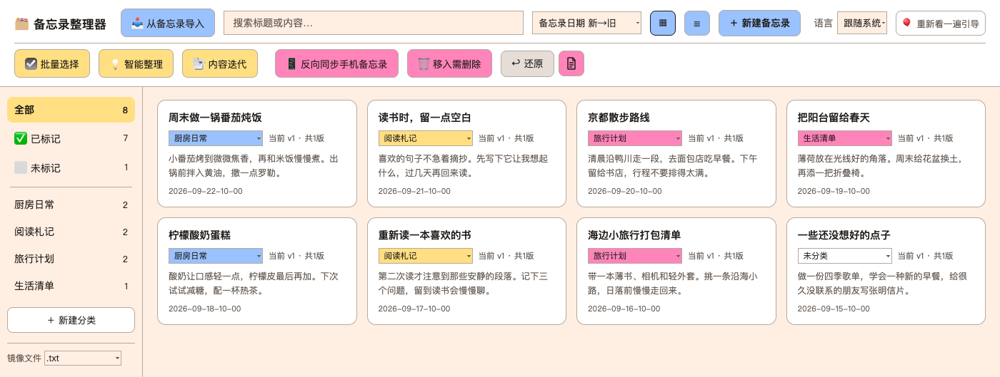
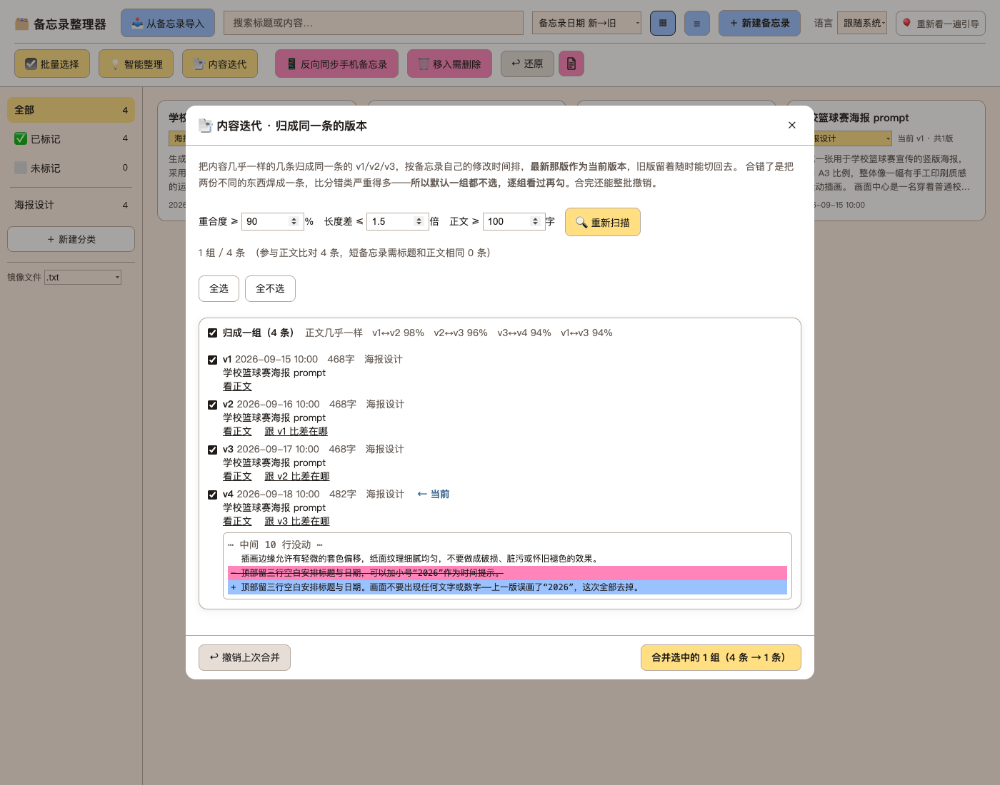

# 苹果备忘录整理器

[English](README.md) | 中文


**自带备忘录起手摩擦最小，所以这个工具让每一个灵感落地。**

对 Siri 说一句就能记，看到什么点两下分享就存下了。正因为记起来太容易，什么都往里扔——上周的食谱、要买的东西、存着以后看的文章、半夜想到的一句话。

但存得越多，回头找起来就越费劲。很多东西记下之后，再也没用上。

这个工具**把备忘录批量导入电脑，分类、编辑、合并重复内容，并保存为本地文本文件**。[^text-format] 整理好后，还能把原备忘录移到对应文件夹；改过的内容也可以单独推送回去。

不用数据线，不用解锁手机，手机上也不用装任何东西。改动都通过 iCloud 自动同步到手机。[^icloud]

> 界面默认跟随 macOS 的首选语言：中文系统显示中文，其他系统显示英文。顶部「语言」可手动切换。[^lang]

## 为什么不直接换个笔记软件

因为随手记下和积攒多了再整理，是两件事。

Obsidian、Notion 等软件适合整理资料。但从「想记」到「字已经在屏幕上」，中间那几步，系统自带备忘录摩擦最小。

这个工具让备忘录继续当那个随手记的地方，同时补上批量整理的功能：


- **批量分类**：分类整理，也可以接入 AI 先给出分类建议，由用户确认后可以反推同步到手机上。
- **保存到本地**：笔记存成文本文件，方便查看、复制和备份。[^ai-data]
- **保护敏感信息**：默认在本机检查 API Key、密码等内容，命中本地规则的笔记跳过发送到 AI 服务器进行分类。规则和不发送的文件夹都可以自己设置。
- **整理原备忘录**：按分类移动原备忘录；待删除的笔记先集中到一个文件夹，由用户最后检查和删除。
- **安装简单**：使用 Python 3 标准库和 macOS 自带的 osascript，不需要另装 Python 包或 npm 依赖。

### 和苹果自带 AI 有什么区别

这个工具围绕的是**积攒了一大批笔记之后，怎样把它们整理成能找到、能使用的资料**：在 Mac 上批量分类，对比并合并同一内容的不同版本，按分类保存本地文本，再检查移动清单，让原备忘录各归其位。移动有记录，也可以按批次还原。

### 适用人群

适合习惯用苹果备忘录随手记录，又需要把积攒的文字整理成作品、方案和工作资料的人。

| 人群 | 手机里随手记什么 | 这个工具能帮什么 |
| --- | --- | --- |
| **需要频繁编辑 Prompt 的 AI 用户** | 提示词、反复修改的指令、不同任务使用的 Prompt | 按用途分类，保留和对比多个版本，选定当前版，随时复制使用，避免越改越乱 |
| **小说作者、编剧、写作者** | 情节、对白、人物设定、不同版本的段落 | 按作品或主题整理零散内容，对比修改，保留旧稿 |
| **编辑、记者、内容创作者** | 选题、采访文字、引文、文章草稿 | 按选题归类素材，把同一内容的多次修改集中起来 |
| **营销、文案、品牌运营人员** | 广告语、活动点子、客户反馈、竞品文案 | 按品牌或项目整理，积累可重复使用的文案和素材 |
| **研究者、学生、知识工作者** | 阅读摘录、观察、问题、研究想法 | 按课题整理，导出文字，继续写报告或论文 |
| **产品经理、创业者、独立开发者** | 用户反馈、需求、产品点子、技术笔记、排错心得 | 把碎片记录归到具体项目，保留方案的修改过程 |
| **咨询顾问、自由职业者** | 客户沟通要点、项目思路、交付草稿 | 按客户和项目整理，减少资料混杂和版本混乱 |

## 截图






## 安装和启动

需要一台装有 Python 3 的 Mac。下面按第一次使用的顺序操作，不用懂代码。还没有安装 Python 3 的话，可以从 [Python 官网下载 Mac 安装包](https://www.python.org/downloads/macos/)。[^python-install] 下载前可以先读源码[^source-readable]，也可以核对下载到的文件[^checksums]。


### 第一步：下载

在仓库页面上方点绿色的 **Code** → **Download ZIP**。下载完双击 zip 解压。

**解压出来的那个文件夹就是程序，直接用，不用搬。**[^icloud-location]

程序和以后整理出来的数据都在这个文件夹里。[^checksums]

### 第二步：打开程序

双击文件夹里的 **`note-organizer.app`**。

**macOS 会拦一下**，弹出的框里有两个按钮，其中一个是「移到废纸篓」。

**别点「移到废纸篓」，点另一个那个。**

这不是程序有问题，是因为它没有购买苹果的开发者签名 —— macOS 对所有没签名的程序都这么提示。接着：

1. 打开 **系统设置 → 隐私与安全性**，往下滚到「安全性」那一段
2. 会看到一行写着刚才那个程序被阻止了，点旁边的 **仍要打开**
3. 再弹一次确认，点 **打开**
4. 这一步需要输入**这台 Mac 的登录密码**

> ⚠️ **「仍要打开」只在刚被拦住之后的一小段时间内出现。** 翻到「隐私与安全性」却找不到它，就回去把 app 再双击一次，然后立刻回来看。

app 打不开的话，双击同一个文件夹里的 **`note-organizer.command`**，它也是启动按钮。

启动后会跳出终端窗口，浏览器自动打开 `http://localhost:8788`。**接下来在网页里操作，终端窗口别关。**

### 第三步：允许访问备忘录

第一次点「📥 从备忘录导入」时，macOS 通常会问：「终端想要控制备忘录」。**这里的「终端」，就是启动整理器时出现的那个窗口。**

这项授权让整理器能够：

- **读取笔记**：列出备忘录，并把选中的笔记导入整理器。
- **新建或更新笔记**：把在整理器里改好的内容存回备忘录。
- **移动笔记**：按照确认过的分类，把原备忘录移到对应文件夹。

**点「允许」不会自动改动整库笔记。** 导入只是复制；存回内容、移动文件夹，需要在工具里另行操作。这项权限同时包含读取和写入，不是只读授权。

要使用上述功能，请点「允许」。如果之前拒绝了，或以后想关闭权限，都可以到 **系统设置 → 隐私与安全性 → 自动化**，找到「终端」下面的「备忘录」开关。

### 制作桌面快捷方式

右键点 `note-organizer.app` 或 `note-organizer.command`，选择「制作替身」，再把替身拖到桌面。以后双击替身即可，程序文件夹留在原处。

## 用法

基本顺序是：**导入 → 在整理器里分类、编辑 → 确认后整理原备忘录**。
AI 分类是可选步骤，不影响整个流程。

### 第一次设置

首次打开空库时，会出现设置引导。可以选用预置分类，修改名称和说明，也可以添加自己的分类。还可以创建分类，并将同名备忘录文件夹加入不发送名单。

每一步都能跳过，API Key 也可以留空。导入、编辑、导出和移动备忘录都不需要 Key。已有数据时不会再显示引导。

### 从备忘录导入

点右上角「📥 从备忘录导入」→ 勾选笔记 → 选择目标分类 → 导入所选。

如果已经在备忘录里分好文件夹，勾选「沿用备忘录的文件夹」，就会按原文件夹创建分类。备忘录默认文件夹、推送和待删除等特殊文件夹中的笔记会放入「未分类」。

- 列表顶部显示当前筛选条数和备忘录总数。
- 「全选当前」会选中筛选结果中的全部笔记，包括尚未滚动显示的部分。
- 搜索、切换文件夹或翻页不会清除已有勾选。
- 导入过的笔记标为「已导入」，默认隐藏，避免重复导入。
- **导入只是复制，不改动备忘录里的原文。**

### 查看和编辑

点开笔记卡片即可编辑。左侧可以按分类查看，也可以用「✅ 已标记 / ⬜️ 未标记」区分已分类和未分类的笔记。

- **保存修改**：覆盖当前正在编辑的版本。快捷键为 `⌘S`。
- **存为新版本**：保留旧版，并将新版设为当前版。
- **切换版本**：点 v1、v2、v3 查看；点「⭐ 设为当前版」可恢复使用旧版。
- **一键复制**：复制当前显示的内容。
- **字数统计**：编辑框下方显示字数和行数；字数不计空格、换行，选中文本时显示选中字数。
- **搜索**：同时搜索标题、正文和历史版本。

### 视图和排序

标题栏的 `▦` / `☰` 可以切换方块视图和列表视图。

有五种排序方式：备忘录日期新→旧（默认）、备忘录日期旧→新、整理器改动时间、按分类、标题 A→Z。

「备忘录日期」指原笔记的修改时间。「整理器改动时间」指在本工具里导入或修改的时间；同一批导入的笔记，这个时间通常相近。

### 批量整理

点「☑️ 批量选择」后，点击卡片即可选中或取消，不会打开编辑框。

- **全选当前**：选中当前筛选结果中的全部笔记。
- **移动**：先在下拉框选择目标分类，再移动所选笔记。每批完成后，目标分类会清空，下次需要重新选择。
- **删除所选**：确认框会列出笔记数和版本数，确认后从整理器中删除。原备忘录仍然保留。

### 合并同一内容的不同版本

点「📑 内容迭代」，工具会把内容相近的笔记分组，供逐组检查是否属于同一篇内容的不同版本。展开后可以对比新增和删除的文字，不属于这一组的笔记可以单独移出。

默认筛选条件是：内容重合度 90%、最长与最短的长度比不超过 1.5 倍、正文至少 100 字。可以按需要调整。

确认合并后，每组按备忘录的修改时间排列，**最新一条作为当前版**，保留它的标题、分类和来源备忘录关联；其余条目的当前内容成为历史版本。没有备忘录日期时，使用整理器中的改动时间。

合并只改变整理器里的记录，原备忘录不动。「撤销上次合并」可以恢复最近一次合并前的条目，合并和撤销都需要确认。

### 把改好的内容存回备忘录

在整理器里修改文字后，备忘录 App 里的原文不会自动改变。要把改好的内容存回去，点「📨 添加备忘录到手机」，再选择要保存到哪一条笔记：

1. **保留原笔记，另外存一条**：选「在备忘录里新建一条」。比如改好了一份食谱，原食谱保留，修改后的食谱另存为一条新笔记。这是默认选项。
2. **更新之前另存的那条**：选「更新上次推送的那条」。如果之前用第一种方式另存了食谱，现在又修改了它，就更新那个副本，不再多建一条。之前另存过才会出现这个选项。
3. **直接修改最初的原笔记**：选「覆盖来源备忘录」。用现在的内容替换当初导入的那条食谱。执行前会显示确认框，请核对要替换的是哪一条。

保存的是**编辑框里现在显示的文字**。如果切回旧版本，就会发送旧版本的内容。

选择「新建一条」时，还可以决定存入哪个文件夹。默认使用与整理器分类同名的文件夹；没有分类时，默认放入 `Notes Organizer`。也可以自行改选，文件夹不存在时会自动创建。

工具不直接删除备忘录。待删除的笔记可以先集中到一个文件夹，由人工检查后自行删除。

### 按分类整理原备忘录

分类确认后，可以把原备忘录移到对应的文件夹。先打开移动清单，检查每条笔记的去向，再执行下面两步。手动分类和 AI 辅助分类的结果，都可以这样应用。

**第一步：按分类移动**

先查看清单，确认每条笔记从哪里移到哪里，再点「📱 反向同步手机备忘录」。

- 已分类的笔记移入同名文件夹；文件夹不存在时自动创建。
- 整理器中未分类、但原备忘录仍在某个分类同名文件夹里的笔记，移回备忘录默认文件夹。
- 没有导入过的笔记不处理。

这一步只移动笔记，不修改正文，也不删除笔记。

**第二步：集中待删除的笔记**

在整理器里已删除、但原备忘录还保留的笔记，会单独列出。查看后点「🗑 移入需删除」，将它们移到 `To delete` 文件夹。

**这里只移动，不会删除。** 请到备忘录里检查这个文件夹，再自行决定是否删除。

**文件夹改名与还原**

如果工具发现原分类对应的文件夹消失，而其中大部分笔记都在另一个文件夹里，会先提示确认是不是改过名。确认后，可以让整理器的分类也使用新名字，不必重新移动笔记。

移动前会记录原文件夹。点「↩︎ 还原」可以退回；一次整理涉及多个分类时，可能分成多批，需要逐批还原。鼠标停在按钮上，可以查看待还原批次的时间和条数。

点「📄 移动记录」可以查看移动清单，文件保存在 `Notes Library/Move Logs/`。

### 用 AI 辅助分类（可选）

笔记多时，可以让 [TypeSafe 的 Jev](https://typesafe.ai) 先给出分类建议。打开「💡 智能整理」，填写 API Key，并为每个分类写一句说明。

例如，「素材」比较笼统；写成「写文章前攒的引文、案例和参考链接」，会更容易判断。没写说明的分类会在开始前提示。

点「💡 获取建议」后，结果会标为「可自动归档」「待确认」「待分类」「跳过」或「出错」。**得到结果后还要手动采纳，工具不会立即移动笔记。** 每行的下拉框都能改建议，再采纳；采纳只更新整理器中的分类，移动原备忘录仍需执行上面的第一步。


Jev 会分别判断一条笔记是否属于各个分类，并给出分数。如果哪个分类都不像，或两个分类得分太接近，就留给人判断。

默认规则如下，可以在设置中修改：

| 结果 | 判断条件 |
| --- | --- |
| 可自动归档 | 最高分至少 0.75，且比第二名至少高 0.15 |
| 待分类 | 最高分低于 0.45 |
| 待确认 | 其余情况，例如得分不够高，或前两名分数接近 |


**哪些内容会发送给 AI**

每条参与 AI 分类的笔记，只发送标题和**正文开头 4000 字**，同时提供分类名称和说明。不会上传整个笔记库或本地文本文件。

发送前先在本机检查：

- **敏感信息**：默认检查 API Key、token、证件号码和「密码：xxx」等内容，命中的笔记标为「跳过」。[^sensitive-limits]
- **不发送的文件夹**：「完全跳过这些文件夹」名单中的笔记，也不会为 AI 分类读取正文或发送。
- **本地关键词**：如果标题或正文开头只命中某一个分类的关键词，就直接给出分类建议，不调用 AI；命中多个分类时，不靠关键词决定。

在 **「💡 智能整理 → 隐私保护」** 中，可以关闭内置检查规则、添加自己的敏感词，或指定哪些备忘录文件夹不参与 AI 分类。自定义词不区分大小写；关闭内置规则后，自定义词仍然生效。

**「敏感信息发送」的意思是：即使检查发现疑似密码或密钥，也允许把这条笔记交给 AI 分类。** 默认不勾选；勾选后，内置规则和自行添加的敏感词都不再阻止发送。

但「完全跳过这些文件夹」始终有效。例如，把备忘录的「账号密码」文件夹加入这个名单，其中的笔记就不会参与 AI 分类，即使勾选了「敏感信息发送」也不会发送。

API Key 保存在 `Notes Library/jev-config.json` 中，文件权限为 `600`（仅当前用户可读写），不纳入 Git，也不会回传到网页。也可以通过环境变量 `TYPESAFE_API_KEY` 提供。


分类结果不理想时，可以展开一行，查看实际读取的正文、各分类得分和分类说明。如果出现「正文是空的」或「分数没拿全」，先检查正文是否读到、服务返回是否完整，再调整分类说明或分数条件。

### 打开本地文本文件

鼠标移到左侧分类上，点 **📂** 在访达打开文件夹，点 **📋** 复制路径。文件位于 `Notes Library/Text Mirror/<分类名>/`，每条笔记的每个版本各有一份，文件名带 `_active` 的是当前版。

左侧「新建分类」下方可以选择 `.txt` 或 `.md`。如果正文原本就使用 Markdown 语法，选 `.md` 后可以用 Markdown 编辑器查看排版。**切换只改变文件扩展名，不转换正文格式**；保存时会清理旧扩展名的副本。

这些文件供查看和复制。要修改内容，请回到整理器中编辑；直接改文件，下次保存时会被覆盖。

## 数据和备份

数据保存在程序文件夹内的 `Notes Library/`：

```text
Notes Library/
├── library.json           笔记库主文件
├── library.backup.json    上一次保存前的备份
├── jev-config.json        Jev 设置和 API Key
├── restore-map.json       移动前的文件夹记录，用于还原
├── merge-log.json         上次合并前的条目，用于撤销
├── Snapshots/             批量删除前的完整备份，最多 10 份
├── Move Logs/             每次整理的移动清单
└── Text Mirror/           按分类保存的文本副本
    └── <分类名>/<标题>_v<N>[_active].txt
```

未分类笔记位于 `Text Mirror/Unfiled/`。选择 `.md` 时，文本副本使用 `.md` 扩展名。

**`library.backup.json` 只保留上一次保存前的状态。** 连续保存会更新它，不能用它找回更早的内容。如果一次保存使笔记数减少至少 10 条，工具会额外保存一份完整备份到 `Snapshots/`，最多保留 10 份。

误删后要恢复，先退出程序，另存一份当前的 `library.json`，再从 `Snapshots/` 选择删除前的文件，复制到 `Notes Library/` 并改名为 `library.json`，最后重新启动。恢复的是当时的整个笔记库，之后的改动不会包含在内。

备份程序数据时，请复制整个 `Notes Library/`。程序本身应放在不参与 iCloud 同步的位置，避免频繁保存产生冲突。

<details>
<summary>旧版目录迁移和启动器设置</summary>

旧版的 `备忘录整理/` 会在首次启动时改名为 `Notes Library/`，相关文件也会改为英文名称。这一步只改名，不改笔记正文。

app 记住的程序位置保存在 `~/Library/Application Support/NoteOrganizer/folder`。

</details>

## 使用限制

- 请在一个浏览器标签页中编辑。同时在多个页面修改时，后保存的内容可能覆盖先保存的内容。
- 一次导入上千条可能需要几分钟，按钮旁会显示进度。中途报错时，会先保存已导入的部分。
- 导入的是文字，不包含图片和附件。备忘录日期使用修改时间，不是创建时间。
- 内容推送目前只支持单条操作。
- 可以有同名笔记，工具通过内部 ID 区分；文本文件重名时自动添加后缀。

## 常见问题

**提示「无法验证开发者」「来自身份不明的开发者」或「已损坏」**

提示「无法验证开发者」时，可以在系统设置中查看「仍要打开」选项；提示「已损坏」时，先重新下载、解压。具体步骤见[打开程序](#第二步打开程序)。[^mac-open]

**双击后终端一闪而过，或没有反应**

如果还没安装 Python 3，先按文末说明安装，再重新打开。[^python-install] 已经装好但仍无法启动时，可以双击 `note-organizer.command`，查看窗口中的错误提示。

**提示端口被占用**

如果上一次启动的整理器还在运行，启动器会直接打开已有页面。其他程序占用 8788 端口时，可以在程序目录运行下面的命令，改用 8799 端口：

```bash
PORT=8799 ./note-organizer.command
```

需要查看谁占用了端口时，运行 `lsof -i :8788`。

**提示没有权限访问备忘录（AppleScript 错误 -1743）**

到「系统设置 → 隐私与安全性 → 自动化」，允许「终端」控制「备忘录」。

**导入的正文是空的**

工具只读取纯文本。如果原笔记只有图片或附件，导入后的正文会是空的。

**数据还在，打开页面却显示空库**

请通过 `note-organizer.app` 或 `note-organizer.command` 启动，并使用它打开的本地网页。直接双击 HTML 文件无法读取笔记库。

**没开 iCloud 也能用吗？**

能。这台 Mac 的「备忘录」里已有的笔记都能整理，包括存在「我的 Mac」账户里的。工具本身不需要登录 Apple 账户。手机那头的同步见文末脚注。[^icloud]

**需要插数据线吗？**

不需要。工具读的是这台 Mac 上的「备忘录」。数据线和访达的设备同步都没法把手机上的笔记成批取过来。

**能用 AirDrop 传过来吗？**

单条可以，AirDrop 过来会直接进 Mac 的「备忘录」，之后就能整理。但没有成批的办法：2026 年 9 月在真机上实测，分享单条笔记有 AirDrop；分享整个文件夹只有「发给联系人一起编辑」，那是协作、需要 iCloud；多选若干条之后只剩加标签、删除、移动，没有分享，所以没法一次把一批传过来。

**怎么知道一条笔记在不在 iCloud 里？**

在 Mac 的「备忘录」里选「显示 → 显示文件夹」，看这条笔记所在文件夹上方的账户名：**iCloud** 还是**我的 Mac**。iPhone 上回到「文件夹」列表也能看到账户分组。只存在手机上的笔记不会自动出现在 Mac 上。

## 原创与许可

**Copyright © 2026 Broken Cake。保留未明确授予的权利。**

本项目由 **Broken Cake 原创设计与维护**。作者对其依法享有著作权的代码、文档、原创视觉及其他作品表达保留相应权利。复制或分发本项目时，请按 [LICENSE](LICENSE) 保留版权声明及许可信息。

**对违反本项目许可的使用，以及在受保护的代码、文案、原创视觉等表达上与本项目高度相似并涉嫌侵权的产品，作者保留调查取证、要求停止侵害、请求赔偿及依法追究法律责任的权利。**[^rights]

本项目采用 [PolyForm Noncommercial 1.0.0](LICENSE)，允许符合许可条件的非商业使用；具体范围以许可证为准。

- ✅ 免费下载、使用、修改、转发，用于个人、学习、爱好
- ✅ 学校、公益组织、政府机构可以直接用
- ❌ **任何商业/盈利用途，需要事先取得作者书面同意** —— 包括打包进付费产品、作为收费服务的一部分、公司内部生产使用

想商用请开一个 [issue](https://github.com/BrokenCake/apple-notes-organizer-en/issues) 联系作者。

---

Free for noncommercial use. **Commercial use requires prior written permission**
— open an issue to ask.

*Presented by Broken Cake*

---

[^text-format]: 本地文本文件默认使用 `.txt`，也可以选择 `.md`。切换只改变扩展名，不会自动把正文转换成 Markdown 排版。

[^ai-data]: 只有在配置并运行需要调用外部服务的 AI 分类时，参与该批分类且未被跳过的笔记才会发送给服务提供方。每条发送标题和正文开头最多 4000 字，同时提供分类名称与说明；本地关键词已能确定分类的笔记不需要调用 AI。导入、手动分类和本地编辑不需要发送给 AI。授权终端操作备忘录与调用外部 AI 是两件事；苹果备忘录自身的 iCloud 同步另按系统设置运行。

[^icloud]: 「改动同步到手机」这部分需要 iCloud 的「备忘录」同步是开着的。没开的话整理照样能做，改动留在这台 Mac 上，不会出现在手机上。

[^lang]: 两套界面共用同一个库；笔记内容不会被翻译，保持原样。

[^mac-open]: 当前 app 未经开发者签名。macOS 对「无法验证开发者」「已损坏」「将损坏电脑」的提示有不同含义，不能一律归因于未签名，也不能据此保证文件安全。若提示恶意软件或「将损坏电脑」，不要继续启动；请检查下载来源。不同系统版本可用的打开方式可能不同，详见 [Apple 的应用安全说明](https://support.apple.com/en-us/102445)。

[^sensitive-limits]: 敏感信息检查是本机按预设格式和自定义词进行的匹配，用于辅助提醒，不保证识别所有敏感内容，也不保证没有误判。

    **为什么普通笔记也会跳过：** 为减少密钥外发，内置规则会把连续 32 位及以上、由英文字母、数字、下划线或连字符组成的字符串视为可疑内容。因此，普通文件的校验值、较长的编号或链接中的标识符，也可能触发跳过。命中只表示符合某条规则，不等于笔记一定含有秘密。

    **哪些内容可能漏掉：** 不符合预设格式的密码、拆开书写的密钥，以及需要结合上下文才能识别的隐私，可能无法识别。未被标记也不代表适合发送给 AI。

    **发送前怎么处理：** 对不希望外发的笔记，优先把它所在的备忘录文件夹加入「完全跳过这些文件夹」，并核对名单与实际文件夹名称。关闭内置检查或勾选「敏感信息发送」会减少拦截。请根据笔记内容决定是否启用外部 AI；这项检查不能替代人工对发送范围的确认，也不构成“不会泄露”的保证。软件按现状提供，责任限制以适用法律及 [LICENSE](LICENSE) 为准。

[^apple-features]: 依据截至 2026 年 9 月 22 日的 Apple 官方说明：[备忘录中的写作工具](https://support.apple.com/en-euro/guide/iphone/iph1ac0b3a2/ios)、[导出 Markdown](https://support.apple.com/en-ie/guide/iphone/iphdf551cfa2/ios)、[Apple Intelligence 与快捷指令](https://support.apple.com/guide/iphone/apple-intelligence-stay-organized-dom122pp864g/27/ios/27)。这些能力与批量整理可以配合使用；本文不主张苹果无法通过快捷指令或后续更新实现相似流程。具体 AI 功能受设备、语言及地区支持情况影响。

[^rights]: 权利保留声明不改变已经授予的许可。是否侵权应结合受保护的具体表达、使用方式、证据及适用法律认定；功能或需求相似本身不当然构成侵权。公开发布记录可作为创作与公开时间的证据之一，不等于对功能想法取得独占权。参考 [WIPO：版权保护范围与创作证明](https://www.wipo.int/en/web/copyright/protection)。

[^source]: 源码可读意味着任何人、或者找个信得过的人，都能自己检查这个程序；它并不能证明代码无害。SHA256 只核对文件有没有被改过，不能说明代码安全。请从信得过的仓库版本获取清单。

[^source-readable]: **下载前可以先读源码**

    程序逻辑是可读的 Python、HTML 和 JavaScript，启动器是文本脚本，图片和图标单独存放。只用 Python 3 标准库和 macOS 自带的工具，没有 npm、第三方 Python 包，也没有 CDN。任何人都能自己看，或者找懂代码的人帮忙看。除了可选的 Jev 分类请求，程序不连任何外部服务；API Key 留空，Jev 就是关着的。苹果备忘录自身的云同步由系统负责。[^source]

    2026-09-22 实测行数：`server.py` 1321 行，中文界面 3341 行，英文界面 3335 行，`jev_classify.py` 305 行，`similar_groups.py` 269 行，`locale_support.py` 191 行，`language.js` 18 行，`note-organizer.command` 12 行。主程序文件里只算中文界面那一份，合计 5457 行；不含图片、转发入口和 app 启动器外壳。

[^icloud-location]: 搬位置的话要**整个文件夹一起搬**，不要只搬 app——只搬 app 之后它找不到 `server.py`，会反过来问程序文件夹在哪。另外别放进开了「桌面与文稿」同步的桌面或文稿里：这个工具每次保存都整份重写库文件，放在 iCloud 里会出现「库 2.json」这种冲突副本，删掉的文件也可能被云端恢复。「下载」文件夹默认不同步，放着就行。

[^checksums]: **如果装不起来，先核对下载解压是否完整。** 仓库里的 [CHECKSUMS.txt](CHECKSUMS.txt) 是这一版各程序文件的 SHA256 清单。解压后打开「终端」，输入 `cd ` 加一个空格，把文件夹拖进终端窗口回车，然后粘贴 `shasum -a 256 -c CHECKSUMS.txt`。每行显示 `OK` 就是完整的。

    校验确认的是文件与同一仓库版本的清单一致，不是代码是否安全。[^source] 也可以单独核对某一个文件，再跟清单比对：

    ```bash
    shasum -a 256 server.py
    ```

    GitHub 的「Download ZIP」是自动打包的，所以校验的是解压后的文件，而不是给整个 ZIP 定一个固定值。清单里任何一个文件有改动，维护者都应该在同一次提交里重新生成 `CHECKSUMS.txt`。

[^python-install]: **安装 Python 3（不用输入命令）**

    1. 在正文的 Python 官方 Mac 下载页中，找到 **Stable Releases（稳定版）**，选择适用于本机 macOS 版本的 **macOS installer**。不用下载源码或测试版。
    2. 双击下载的 **`.pkg` 安装包**，按窗口提示点「继续」「同意」「安装」。需要时输入 Mac 的管理员密码。
    3. 安装完成后，打开「应用程序」里的 `Python 3.x` 文件夹，双击 **`Install Certificates.command`** 完成网络证书配置。它会自动打开终端窗口；看到 `update complete` 后关闭即可，**不用输入任何命令**。
    4. 重新双击 `note-organizer.app`，或同目录的 `note-organizer.command`。

    这是 Python 官方提供的安装方式，详细图示见 [Python 的 Mac 安装说明](https://docs.python.org/3/using/mac.html#installation-steps)。

    **终端备用方式：安装 Xcode 命令行工具**

    如果希望使用 Apple 开发工具提供的 Python，可以在终端运行以下命令，按弹出的窗口提示安装后再启动整理器。已经按上面装好 Python 的用户不需要再做这一步。

    ```bash
    xcode-select --install
    ```

    **使用命令行下载和启动整理器**

    ```bash
    git clone https://github.com/BrokenCake/apple-notes-organizer-en.git
    cd apple-notes-organizer-en
    chmod +x note-organizer.command
    ./note-organizer.command
    ```
